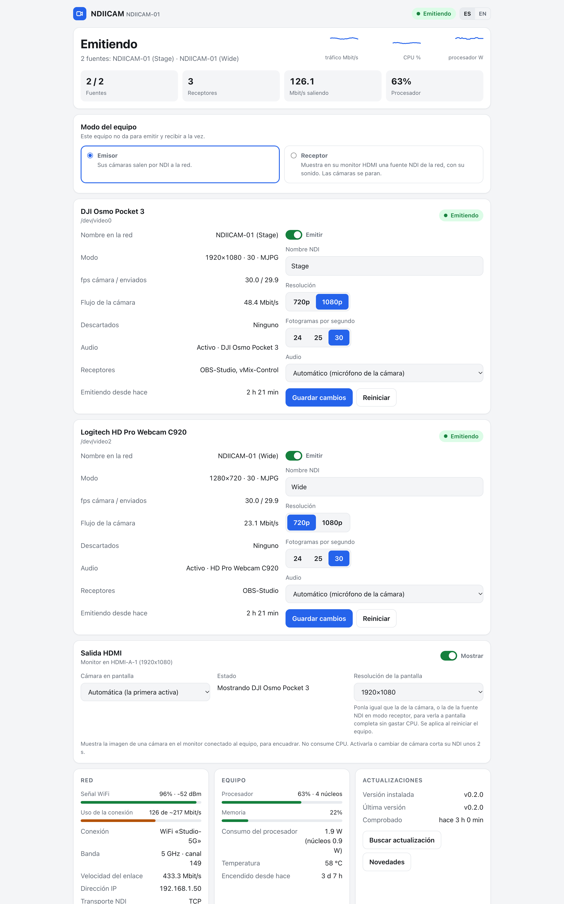
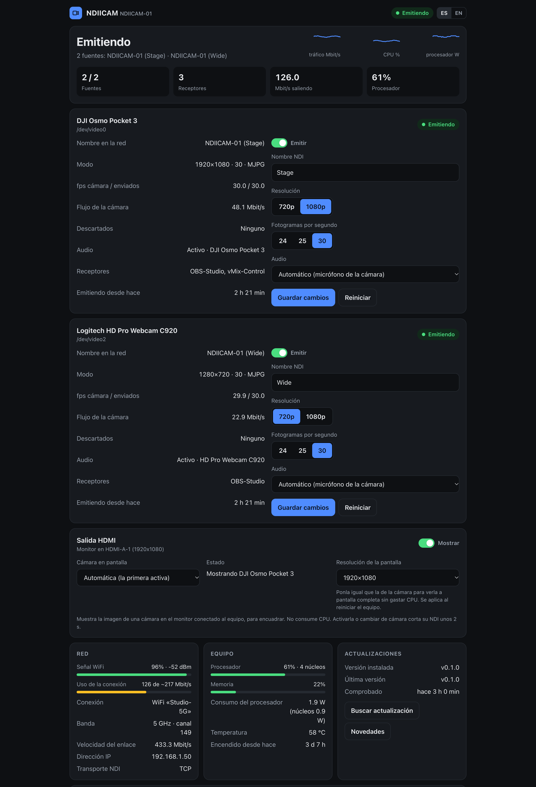
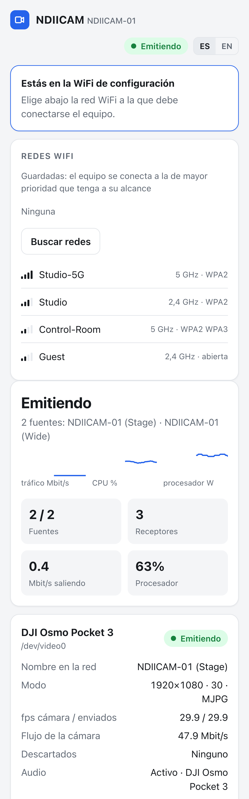
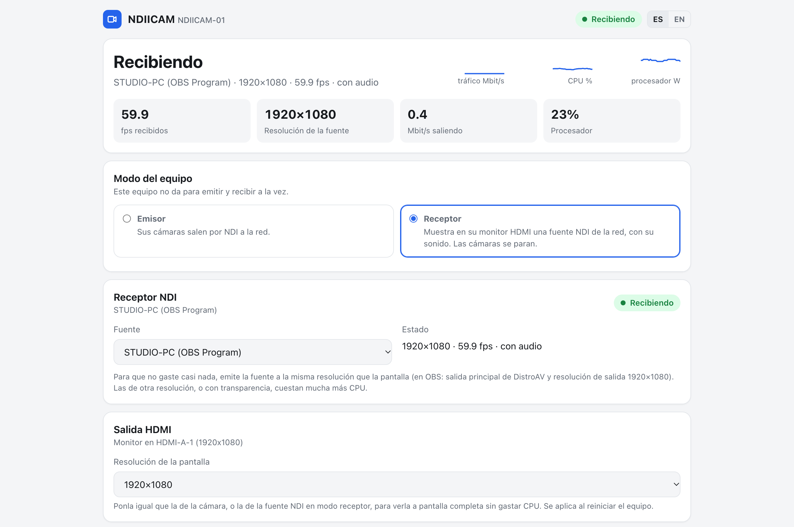

# NDIICAM

**Convierte cualquier PC x86_64 con Linux (Intel/AMD) y una cámara USB en una cámara NDI® lista para usar.**

[English](README.md)

Conectas una cámara USB a un PC pequeño y aparece como fuente NDI en tu red: en OBS,
vMix, NDI Studio Monitor o cualquier receptor NDI. O al revés: en **modo receptor** muestra
una fuente NDI de la red en la tele o el monitor conectado a su HDMI, con sonido. Todo se
gestiona desde un panel web: tras la instalación no hace falta la terminal.

## Capturas



<table>
  <tr>
    <td width="68%"></td>
    <td width="32%"></td>
  </tr>
  <tr>
    <td align="center">El tema oscuro sigue al del sistema</td>
    <td align="center">WiFi de configuración desde el móvil</td>
  </tr>
</table>



<sub>Las capturas usan datos de demostración (<code>docs/screenshots/demo.py</code>).</sub>

## Funciones

- **Emite cada cámara UVC conectada como fuente NDI propia** (MJPEG o YUYV) a 720p o 1080p,
  hasta 60 fps, **con el micrófono de la cámara** como audio NDI si lo tiene.
- **Panel web** en `http://<equipo>.local`: estado en vivo, fps, tasa de datos, receptores
  conectados, señal WiFi y uso del enlace, CPU y temperatura. En español e inglés.
- **WiFi de configuración**: si no hay ninguna red conocida, el equipo crea su propia WiFi
  con portal cautivo. Te conectas desde el móvil, eliges tu red, pones la clave y listo.
- **Se recupera solo**: detecta la cámara al enchufarla, reinicia la emisión si la cámara
  deja de dar imagen y vuelve a las redes conocidas cuando reaparecen.
- **Monitor de encuadre por HDMI**: muestra una cámara a pantalla completa en el monitor conectado al
  equipo, directo a la GPU y sin gastar CPU. Se activa y desactiva desde el panel.
- **Modo receptor**: el equipo para sus cámaras y se convierte en receptor NDI: eliges cualquier
  fuente NDI de la red (OBS, vMix, una app del móvil, otro NDIICAM…) y sale por el HDMI con su
  audio. Si la fuente se va, se reconecta solo. Un Atom pequeño no da para emitir y recibir a la
  vez, así que es un modo o el otro.
- **IP fija, copia de seguridad, valores de fábrica y actualización con un clic** desde el panel.
- **Decodificación JPEG adaptativa**: si la imagen de la cámara se vuelve demasiado detallada para
  un núcleo (noche, público, follaje), la decodificación se reparte sola en más hilos y los 1080p30
  se mantienen.
- **Ligero**: un único servicio en Python sobre GStreamer, sin frameworks web ni base de datos.

## Requisitos

| | |
|---|---|
| CPU | x86_64 Intel o AMD. Un Atom x5-Z8350 (4 núcleos, 1,44 GHz) emite 1080p30 con ~1,6 núcleos y lo recibe con ~0,6-0,9 |
| Sistema | Ubuntu 24.04 LTS (probado). Debian 12+ debería funcionar |
| Cámara | Cámara USB UVC con MJPEG (la mayoría de webcams, DJI Osmo Pocket 3 en modo webcam…) |
| Red | Mejor por cable. Por WiFi funciona: 1080p30 son ~90 Mbit/s por receptor |
| Tarjeta WiFi (opcional) | Necesaria para la WiFi de configuración. Las que admiten AP y cliente a la vez (p. ej. Intel 3165) no sueltan la conexión mientras está activa |

## Instalación

```bash
git clone https://github.com/ithesk/NDIICAM.git
cd NDIICAM
sudo ./install.sh
```

O en una línea:

```bash
curl -fsSL https://raw.githubusercontent.com/ithesk/NDIICAM/main/install.sh | sudo bash -s -- --accept-ndi-license
```

El instalador:

1. Instala las dependencias (GStreamer, NetworkManager, hostapd, Avahi…).
2. Descarga el runtime del **NDI® SDK** de los servidores oficiales de NDI. Es software
   privativo de Vizrt NDI AB: te pide aceptar su licencia (`--accept-ndi-license` la
   acepta sin preguntar).
3. Instala el plugin NDI de GStreamer de
   [gst-plugins-rs](https://gitlab.freedesktop.org/gstreamer/gst-plugins-rs) (MPL-2.0),
   precompilado por la CI de este repositorio (`--build-plugin` lo compila en el equipo).
4. Instala y arranca el servicio `ndiicam`.
5. Pasa la red a **NetworkManager** si la gestionan netplan y systemd-networkd (Ubuntu
   Server). La red se corta unos segundos; si no vuelve en 90 s, se restaura sola la
   configuración anterior. Se omite con `--no-network`. Conserva la identidad DHCP, así que
   el router sigue dando la misma IP.

Volver a ejecutar el instalador actualiza NDIICAM y conserva la configuración.

## Primer uso

1. Conecta la cámara. La emisión empieza sola.
2. Abre `http://<equipo>.local` (el instalador te da la dirección).
3. En OBS: *Añadir fuente → NDI Source* (con [DistroAV](https://github.com/DistroAV/DistroAV))
   y elige `<EQUIPO> (NDIICAM)`.

**¿Sin red?** Tras 60 s sin ninguna red conocida, el equipo activa la WiFi de configuración
`NDIICAM-XXXX` (clave `ndiicam-setup`, cámbiala en el panel). Conéctate desde el móvil: el
panel se abre solo. Elige tu red y escribe su clave. El resultado sale en la misma pantalla;
después vuelve a tu red y abre `http://<equipo>.local`.

## Panel

| Sección | Qué hace |
|---|---|
| Estado | Estado general, fuentes emitiendo, receptores, Mbit/s saliendo, CPU, gráficas de los últimos 2 minutos |
| Una tarjeta por cámara | Activar/desactivar, nombre NDI, modo, fps de cámara/enviados, tasa, descartes, audio, receptores por nombre; ajustes: nombre NDI, 720p/1080p, fps, audio (micro de la cámara, otra entrada o ninguno) |
| Modo del equipo | Emisor (cámaras a NDI) o receptor (una fuente NDI al HDMI) |
| Receptor NDI | Solo en modo receptor: fuentes NDI encontradas en la red, cuál mostrar, resolución, fps y audio recibidos |
| Salida HDMI | Activar/desactivar, qué cámara, estado del monitor, resolución de la pantalla al arrancar |
| Red | Señal WiFi, uso del enlace frente a la capacidad estimada, banda, canal, IP, transporte NDI |
| Actualizaciones | Versión instalada y última, comprobar, instalar con un clic |
| Redes WiFi | Redes guardadas (olvidar), buscar, conectar |
| Dirección IP | DHCP o fija. Si con la fija no hay conexión, vuelve sola a la anterior |
| Equipo | Nombre del equipo, transporte NDI, nombre y clave de la WiFi de configuración, país, contraseña opcional del panel, descargar/restaurar copia, valores de fábrica, reiniciar |

La contraseña del panel no se pide desde la WiFi de configuración: quien está en ella ya
conoce su clave, y es la forma de volver a entrar si se olvida la del panel.

## Notas técnicas

Salen de montarlo en hardware real y explican algunos valores por defecto:

- **El transporte NDI va por TCP.** Con el UDP fiable que NDI 6 usa por defecto, algunos
  receptores (OBS en macOS en nuestras pruebas) veían la fuente pero nunca recibían vídeo.
  TCP funciona en todos. Se puede cambiar a UDP en el panel.
- **Avahi es imprescindible.** El NDI SDK en Linux anuncia las fuentes a través de Avahi;
  sin él la emisión funciona pero ningún receptor la encuentra.
- **Se desactiva el ahorro de energía de la WiFi** (`wifi.powersave = 2`): provoca tirones
  en un flujo constante de ~90 Mbit/s.
- **El pipeline va repartido en hilos.** Decodificación, conversión de color y codificación
  NDI corren en hilos distintos con colas que descartan. En un solo hilo, un Atom solo llega
  a ~22 fps a 1080p; repartido, mantiene 30 fps. Si la CPU se queda atrás, se descartan
  fotogramas viejos en vez de acumular retraso.
- **Sin GPU, medido de tres formas.** En Intel Cherry Trail (driver i965) `vaapijpegdec` va a
  30-60 fps con un 10-40% de CPU, pero todos los fotogramas salen negros: las superficies decodificadas
  no se pueden leer desde memoria. El driver no expone procesado de vídeo (VPP), así que tampoco hay
  escalado ni conversión por GPU. OpenGL ES funciona sin pantalla (EGL/GBM) y escala 720p→1080p a
  memoria con un 24% de CPU, pero al alimentar `kmssink` desde ahí cae a 11 fps. La codificación
  SpeedHQ de NDI es solo por CPU en cualquier caso; NDI|HX con H.264 por hardware exigiría el NDI
  Advanced SDK.
- **La decodificación JPEG es el cuello de botella del emisor.** `jpegdec` va en un solo hilo: un
  fotograma real de cámara a 1080p30 (~210 KB) cuesta el 68% de un núcleo, y uno muy detallado más
  del 100%, con lo que cae a ~21 fps mientras los demás núcleos no hacen nada. La conversión de color
  es barata (10-16%) y mandar I420 al NDI en vez de UYVY no ahorra nada (el SDK convierte por dentro).
  Con `decodificadores` en automático, el servicio arranca con uno y, cuando la cámara entrega más
  fotogramas de los que salen por NDI, reinicia la fuente repartiendo los fotogramas por turnos entre
  2-3 decodificadores, reordenados después. Escalado medido: 1 → 21,8 fps, 2 → 40,5, 3 → 59,3 fps con
  fotogramas pesados; +10% de CPU cuando no hace falta.
- **La salida HDMI va directa a un plano de vídeo de la GPU** (`kmssink`, UYVY): no gasta CPU.
  Algunos planos no escalan (Intel Cherry Trail): para verla a pantalla completa, pon en el panel la
  resolución de la pantalla igual a la de la cámara. Escribe `video=` en
  `/etc/default/grub.d/90-ndiicam.cfg` y requiere reiniciar. Las entradas de GRUB personalizadas con
  la línea de arranque fija no lo recogen: añádeles `video=1920x1080@60` a mano. Convertir a RGB para
  escalar por CPU cuesta +70-150% de CPU en un Atom.
- **El modo receptor también muestra la fuente en un plano de vídeo de la GPU.** NDI decodifica a
  UYVY, que va al plano tal cual: recibir 1080p30 costó ~0,6-0,9 núcleos en el Atom, según la imagen.
  `kmssink` necesita `skip-vsync`, o espera dos refrescos por imagen y se queda en 30 fps en una
  pantalla de 60 Hz. Las fuentes de otra resolución se escalan por CPU (vecino más próximo, con
  bordes), y eso es caro: el filtro "NDI Output" por fuente de OBS manda cada fuente a su tamaño
  original **con transparencia**, y una captura de pantalla de 2530×1378 gastó ~3 núcleos y llegó a
  colgar el Atom. Manda el programa (salida principal de DistroAV, resolución de salida de OBS = la
  de la pantalla). El receptor corre con prioridad baja y deja un núcleo libre al sistema y la red.
- **El consumo del procesador** del panel sale de Intel RAPL y solo cubre el SoC (CPU + GPU), no la
  WiFi, la memoria, la placa ni la cámara. En el Atom: 0,9 W en reposo, 1,7 W emitiendo 1080p30.
- **La WiFi de configuración usa una interfaz virtual `ap0`** cuando la tarjeta lo permite,
  así el equipo sigue buscando sus redes mientras tanto. Si no, alterna: 3 minutos de AP y
  45 s buscando redes, mientras nadie esté conectado al AP.

## Problemas frecuentes

| Problema | Qué mirar |
|---|---|
| La fuente no aparece en el receptor | `avahi-daemon` activo; receptor y equipo en la misma red/VLAN; que la WiFi no aísle a los clientes ni bloquee mDNS |
| Aparece la fuente pero sin imagen | Pon el transporte en TCP desde el panel |
| Tirones por WiFi | Barra de uso del enlace en el panel; 5 GHz; 720p; mejor por cable |
| El modo receptor va lento | La fuente no tiene la resolución de la pantalla o trae transparencia: mándala a la resolución de la pantalla (en OBS, salida principal de DistroAV) |
| Los fps de cámara superan a los fps NDI en una cámara MJPEG | La decodificación no da abasto; el servicio añade hilos solo (evento "la decodificación no da abasto"). A mano, en *Equipo → Decodificación JPEG* |
| El panel no abre | `systemctl status ndiicam`; otro programa en el puerto 80 |
| Registros | `journalctl -u ndiicam -f`; el del cambio de red en `/var/lib/ndiicam/red.log` |

## Desinstalar

```bash
sudo ./uninstall.sh                  # quita NDIICAM y deja la red como está
sudo ./uninstall.sh --restore-network --purge   # además restaura netplan/networkd y borra SDK, plugin y ajustes
```

## Licencia

NDIICAM es software libre bajo la **GNU General Public License v3.0 o posterior**
([LICENSE](LICENSE)). Copyright © 2026 Pablo Holguín.

NDIICAM no incluye el NDI® SDK: el instalador lo descarga de NDI y se rige por su propia
licencia. **NDI® es una marca registrada de Vizrt NDI AB.** NDIICAM no está afiliado a
Vizrt NDI AB ni cuenta con su respaldo. El plugin NDI de GStreamer forma parte de
gst-plugins-rs (MPL-2.0).
