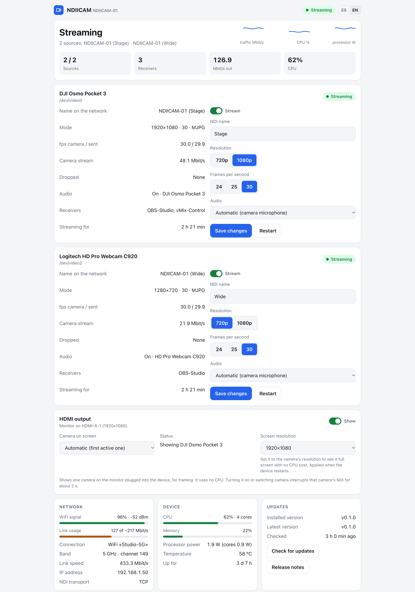
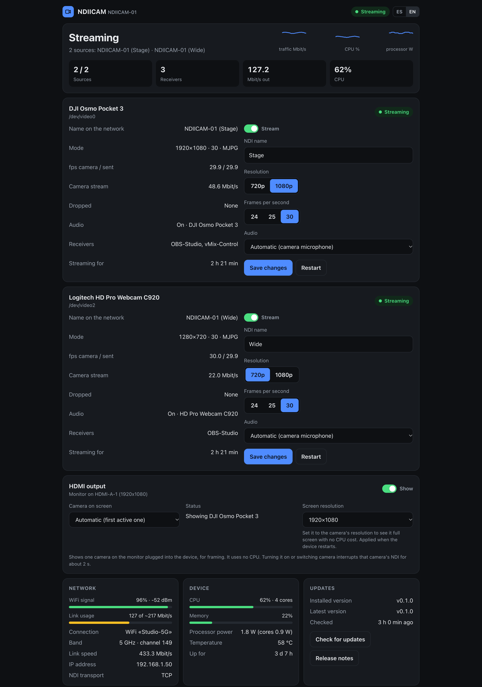
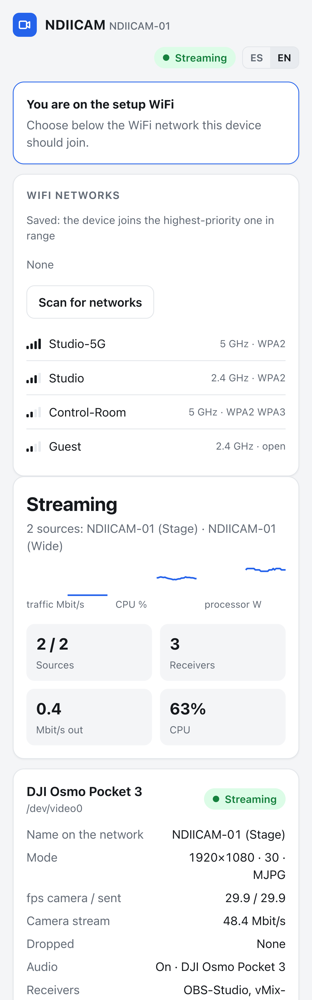

# NDIICAM

**Turn any x86_64 Linux PC (Intel/AMD) and a USB camera into a plug-and-play NDI® camera.**

[Español](README.es.md)

Plug a USB camera into a small PC and it shows up as an NDI source on your network —
in OBS, vMix, NDI Studio Monitor or any NDI receiver. Everything is managed from a web
panel: no terminal needed after installation.

## Screenshots



<table>
  <tr>
    <td width="68%"></td>
    <td width="32%"></td>
  </tr>
  <tr>
    <td align="center">Dark mode follows the system theme</td>
    <td align="center">Setup WiFi on a phone</td>
  </tr>
</table>

<sub>Screenshots use demo data (<code>docs/screenshots/demo.py</code>).</sub>

## Features

- **Streams every UVC camera plugged in as its own NDI source** (MJPEG or YUYV) at 720p or 1080p,
  up to 60 fps, **with the camera's microphone** as NDI audio when it has one.
- **Web panel** at `http://<device>.local`: live status, frame rate, bitrate, connected
  receivers, WiFi signal and link usage, CPU and temperature. In English and Spanish.
- **Setup WiFi**: with no known network in range, the device creates its own WiFi with a
  captive portal. Join it from your phone, pick your network, type the password, done.
- **Self-healing**: detects the camera when plugged in, restarts the stream if the camera
  stops sending frames, reconnects to known networks when they come back.
- **HDMI framing monitor**: shows one camera full screen on the monitor plugged into the device,
  straight to the GPU, with no CPU cost. On/off from the panel.
- **Static IP, backup/restore, factory reset and one-click updates** from the panel.
- **Light**: one Python service on top of GStreamer, no web frameworks, no database.

## Requirements

| | |
|---|---|
| CPU | x86_64 Intel or AMD. An Atom x5-Z8350 (4 cores, 1.44 GHz) handles 1080p30 using ~1.6 cores |
| OS | Ubuntu 24.04 LTS (tested). Debian 12+ should work |
| Camera | USB UVC camera with MJPEG (most webcams, DJI Osmo Pocket 3 in webcam mode…) |
| Network | Ethernet recommended. WiFi works: 1080p30 uses ~90 Mbit/s per receiver |
| WiFi card (optional) | Needed for the setup WiFi. Cards that support AP + client at once (e.g. Intel 3165) keep the client connection while the setup WiFi is on |

## Install

```bash
git clone https://github.com/ithesk/NDIICAM.git
cd NDIICAM
sudo ./install.sh
```

Or in one line:

```bash
curl -fsSL https://raw.githubusercontent.com/ithesk/NDIICAM/main/install.sh | sudo bash -s -- --accept-ndi-license
```

The installer:

1. Installs the dependencies (GStreamer, NetworkManager, hostapd, Avahi…).
2. Downloads the **NDI® SDK** runtime from the official NDI servers. It is proprietary
   software by Vizrt NDI AB: you are asked to accept its license
   (`--accept-ndi-license` accepts it without asking).
3. Installs the GStreamer NDI plugin from
   [gst-plugins-rs](https://gitlab.freedesktop.org/gstreamer/gst-plugins-rs) (MPL-2.0),
   prebuilt by this repository's CI (`--build-plugin` builds it locally instead).
4. Installs and starts the `ndiicam` service.
5. Moves the network to **NetworkManager** if it is managed by netplan + systemd-networkd
   (Ubuntu Server). The network drops for a few seconds; if it is not back within 90 s, the
   previous configuration is restored automatically. Skip with `--no-network`. The DHCP
   identity is preserved so the router keeps giving the same IP.

Running the installer again updates NDIICAM and keeps your settings.

## First use

1. Plug in the camera. Streaming starts by itself.
2. Open `http://<device>.local` (the installer prints the address).
3. In OBS: *Add source → NDI Source* (with [DistroAV](https://github.com/DistroAV/DistroAV))
   and pick `<DEVICE> (NDIICAM)`.

**No network?** After 60 s without any known network the device turns on the setup WiFi
`NDIICAM-XXXX` (password `ndiicam-setup`, change it in the panel). Join it from a phone:
the panel opens by itself. Pick your network and type its password. The result is shown on
the same screen; then go back to your network and open `http://<device>.local`.

## Panel

| Section | What it does |
|---|---|
| Status | Overall state, sources streaming, receivers, outgoing Mbit/s, CPU, last-2-minute graphs |
| One card per camera | On/off, NDI name, mode, camera/sent fps, bitrate, dropped frames, audio, receivers by name; settings: NDI name, 720p/1080p, fps, audio (camera mic, another input or none) |
| HDMI output | On/off, which camera, monitor status, screen resolution at boot |
| Network | WiFi signal, link usage against the estimated capacity, band, channel, IP, NDI transport |
| Updates | Installed and latest version, check, install with one click |
| WiFi networks | Saved networks (forget), scan, connect |
| IP address | DHCP or static. If the static address has no connectivity, it reverts by itself |
| Device | Device name, NDI transport, setup WiFi name and password, country, optional panel password, backup download/restore, factory reset, reboot |

The optional panel password is not asked from the setup WiFi: anyone on it already knows
its password, and it is the way back in if you forget the panel password.

## Technical notes

These come from building it on real hardware, and explain some of the defaults:

- **NDI transport defaults to TCP.** With NDI 6's default reliable UDP, some receivers
  (OBS on macOS in our tests) saw the source but never got video. TCP works everywhere.
  You can switch to UDP in the panel.
- **Avahi is required.** The NDI SDK on Linux announces sources through Avahi; without it
  the stream runs but no receiver can find it.
- **WiFi power saving is turned off** (`wifi.powersave = 2`): it causes stutter in a
  constant ~90 Mbit/s stream.
- **The pipeline is split in threads.** Decoding, color conversion and NDI encoding run in
  separate threads through leaky queues. In a single thread, an Atom only reaches ~22 fps
  at 1080p; split, it holds 30 fps. If the CPU falls behind, old frames are dropped instead
  of building latency.
- **No VAAPI.** On Intel Cherry Trail the iGPU decodes JPEG, but the decoded frames cannot
  be mapped back to system memory (every frame fails), and NDI's SpeedHQ encoding is CPU-only
  anyway. NDI|HX with hardware H.264 would need the NDI Advanced SDK.
- **HDMI output goes straight to a GPU video plane** (`kmssink`, UYVY), so it costs no CPU. Some
  planes cannot scale (Intel Cherry Trail): to see it full screen, set the screen resolution to
  the camera's in the panel. It writes `video=` to `/etc/default/grub.d/90-ndiicam.cfg` and needs a
  reboot. Custom GRUB entries with a fixed command line do not pick it up: add `video=1920x1080@60`
  to them by hand. Converting to RGB to scale on the CPU costs +70-150% CPU on an Atom.
- **Processor power** in the panel comes from Intel RAPL and covers the SoC (CPU + GPU) only, not
  WiFi, memory, board or camera. On the Atom: 0.9 W idle, 1.7 W streaming 1080p30.
- **The setup WiFi runs on a virtual `ap0` interface** when the card supports it, so the
  device keeps trying known networks meanwhile. Otherwise it alternates: AP for 3 minutes,
  then 45 s looking for networks, while nobody is connected to the AP.

## Troubleshooting

| Problem | Check |
|---|---|
| Source not listed in the receiver | `avahi-daemon` running; receiver and device on the same network/VLAN; mDNS not blocked by the WiFi (client isolation) |
| Source listed, no video | Set transport to TCP in the panel |
| Stutter over WiFi | Link usage bar in the panel; 5 GHz; use 720p; prefer Ethernet |
| Panel unreachable | `systemctl status ndiicam`; something else on port 80 |
| Logs | `journalctl -u ndiicam -f`; network migration log in `/var/lib/ndiicam/red.log` |

## Uninstall

```bash
sudo ./uninstall.sh                  # removes NDIICAM, keeps the network as it is
sudo ./uninstall.sh --restore-network --purge   # also restores netplan/networkd and removes SDK, plugin and settings
```

## License

NDIICAM is free software under the **GNU General Public License v3.0 or later**
([LICENSE](LICENSE)). Copyright © 2026 Pablo Holguín.

NDIICAM does not include the NDI® SDK: the installer downloads it from NDI and its own
license applies. **NDI® is a registered trademark of Vizrt NDI AB.** NDIICAM is not
affiliated with or endorsed by Vizrt NDI AB. The GStreamer NDI plugin is part of
gst-plugins-rs (MPL-2.0).
